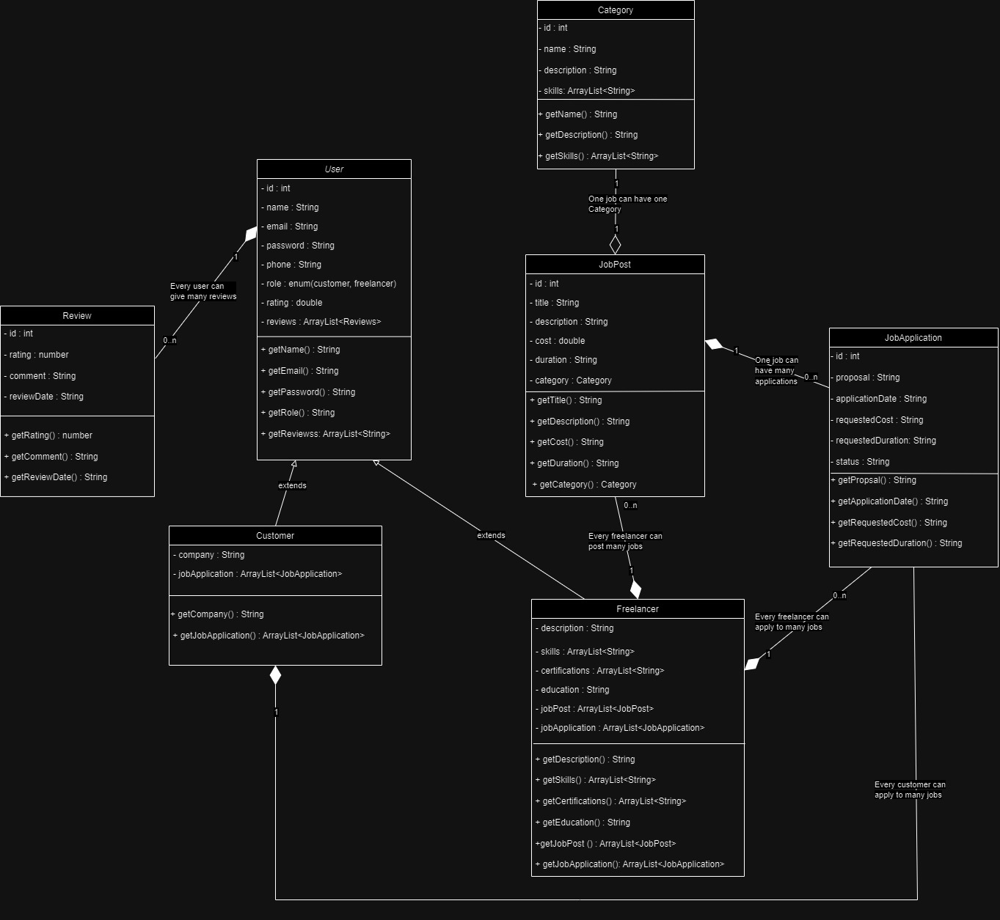

# talenthive.com

## Description
* Talent Hive is an online platform connecting freelancers with clients seeking top-notch services. Whether you're a skilled professional looking to offer your expertise or a client in need of quality freelance services, Talent Hive is the place to be.

## Key Features
* Diverse Services: Explore a wide array of freelance services, from graphic design and writing to programming and more.
* Effortless Transactions: Our platform ensures secure and seamless transactions, providing a trustworthy environment for both freelancers and clients.
* Review and Ratings System: Build trust through our robust review and ratings system. Leave feedback to help others make informed decisions.
* Flexible Payments: Enjoy convenient payment options, making financial transactions smooth for both freelancers and clients.
* User-Friendly Interface: With an intuitive design, Talent Hive offers a user-friendly experience, ensuring easy navigation for all users.

### Getting Started
* To get started with TalentHive, follow these steps:
    * Sign Up: Create your Talent Hive account as either a client or a freelancer.
    * Profile Setup: Complete your profile with relevant information, skills, and experience.
    * Browse Services: Explore the diverse range of services offered by freelancers.
    * Hire or Get Hired: Initiate your freelance journey by either hiring a freelancer or   offering your services.

### Contributors
* Shrivatsa
* Sameer
* Samiksha
* Adwait

## Object Model

